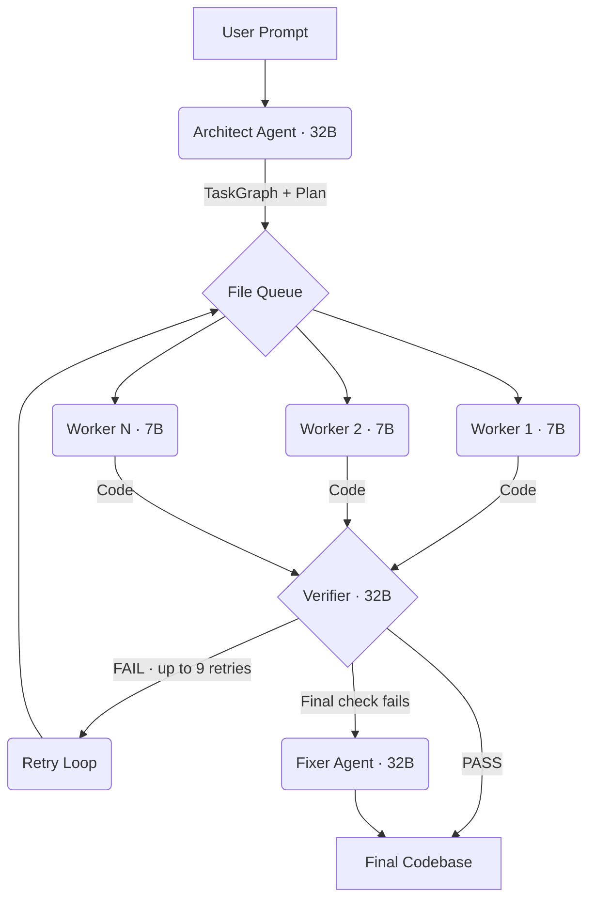

# CogniRoute 🧠

CogniRoute is a multi-agent AI code generation orchestrator. Instead of generating one massive block of code, it breaks your request into a structured plan of individual files, generates each one with specialized LLM agents, and self-verifies the output with automatic retry on failure.

## How it works



Four agents under the hood:

1. **Architect** (32B) — Analyzes your prompt, reasons about architecture, and outputs a structured TaskGraph of files to generate.
2. **Workers** (7B) — Each worker generates code for a single file, scoped to its task context + domain-specific skill injection.
3. **Verifier** (32B) — Validates each file for real bugs (missing imports, syntax errors, empty functions). Files that fail get retried up to 9 times.
4. **Fixer** (32B) — If the final cross-file consistency check fails, the fixer rewrites problematic files.

## Project structure

```
├── backend/                    # FastAPI + Python 3.11
│   ├── app/main.py             # HTTP layer (FastAPI endpoints)
│   └── cogniroute/             # Core orchestration engine
│       ├── orchestration_loop.py   # Main pipeline + SSE streaming
│       ├── architect_agent.py      # Two-phase planning
│       ├── code_worker.py          # Skill-injected code generation
│       ├── verifier_agent.py       # Per-file + cross-file verification
│       ├── fixer_agent.py          # Post-verification global fixer
│       ├── services/llm.py         # Role-routed LLM inference
│       ├── skills/                 # Markdown skill injections
│       └── schemas/                # Pydantic models
│
├── frontend/                   # Next.js 15 + React 19 + Tailwind v4
│   └── app/page.tsx            # Real-time orchestration dashboard
│
└── state/                      # Runtime state (generated plans + contracts)
```

## Running locally

You'll need Python 3.10+ and Node.js 18+.

### 1. Backend

```bash
cd backend
python3 -m venv .venv
source .venv/bin/activate
pip install -r requirements.txt

# Copy and configure environment variables
cp ../.env.example ../.env
# Edit .env with your LLM endpoint details

uvicorn app.main:app --reload --port 8000
```

### 2. Frontend

```bash
cd frontend
npm install

# Copy and configure environment variables
cp .env.example .env.local
# Edit .env.local if your backend is not at localhost:8000

npm run dev
```

Open [http://localhost:3000](http://localhost:3000) to see the dashboard.

## Deployment

### Frontend (Vercel)

1. Push to GitHub
2. Import the repo in [Vercel](https://vercel.com)
3. Set the **Root Directory** to `frontend`
4. Add the environment variable `NEXT_PUBLIC_BACKEND_URL` pointing to your deployed backend
5. Deploy

### Backend (Docker)

```bash
docker build -t cogniroute-backend -f Dockerfile .
docker run -p 8000:8000 \
  -e COGNIROUTE_OPENAI_BASE_URL=https://your-llm-endpoint \
  -e COGNIROUTE_OPENAI_API_KEY=your-key \
  cogniroute-backend
```

## API

| Endpoint | Method | Description |
|---|---|---|
| `/` | GET | Service info |
| `/health` | GET | Health check |
| `/generate` | POST | Synchronous — runs full pipeline, returns results |
| `/generate/stream` | POST | SSE — streams orchestration events in real-time |

## Environment variables

| Variable | Required | Description |
|---|---|---|
| `COGNIROUTE_OPENAI_BASE_URL` | Yes | LLM endpoint (vLLM or OpenAI-compatible) |
| `COGNIROUTE_OPENAI_API_KEY` | No | API key for the LLM endpoint |
| `COGNIROUTE_ARCHITECT_BASE_URL` | No | Override endpoint for architect (32B) |
| `COGNIROUTE_WORKER_BASE_URL` | No | Override endpoint for workers (7B) |
| `COGNIROUTE_VERIFIER_BASE_URL` | No | Override endpoint for verifier (32B) |
| `NEXT_PUBLIC_BACKEND_URL` | Yes (frontend) | Backend API URL |

## License

MIT
