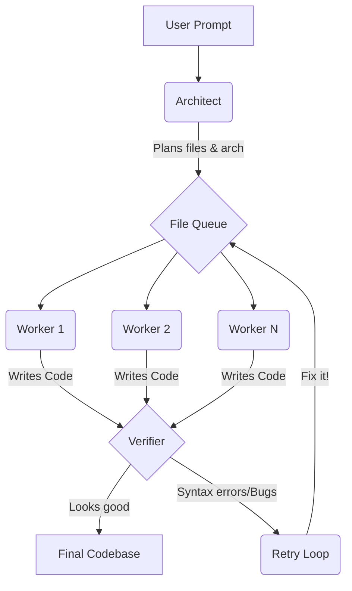

# CogniRoute 🧠

CogniRoute is an experimental multi-agent AI tool that writes code by actually planning it out first. It's basically a backend orchestrator paired with a Next.js dashboard so you can watch the AI think and build in real-time.

Instead of just spitting out one massive block of code like standard LLMs, CogniRoute breaks the task down into smaller files, writes them in parallel, and then checks its own work.

## How it works



There are three main "agents" under the hood:

1. **Architect**: You give it a prompt, and it figures out the system architecture. It outputs a JSON plan of exactly what files need to exist and what they should do.
2. **Workers**: These run in parallel. Each worker grabs a file from the Architect's plan and writes the actual code for it.
3. **Verifier**: The auditor. It checks the generated code for syntax errors or obvious logic flaws. If it catches something, it rejects the file and sends it back to the workers with fix instructions.

## What's inside

- **`backend/`**: FastAPI app (Python 3.10+). This runs the actual orchestration loop and streams the events via SSE.
- **`frontend/`**: Next.js 15 UI. Just a clean dark mode dashboard to track the live traces, read the Architect's reasoning, and view the code as it's generated.
- **`state/`**: Local directory where the final generated files and state get dumped.

## Running it locally

You'll need Python 3.10+ and Node.js 18+.

**1. Start the backend:**

```bash
cd backend
python3 -m venv .venv
source .venv/bin/activate
pip install -r requirements.txt

# Start the API on port 8000
uvicorn app.main:app --reload --port 8000
```

**2. Start the frontend:**

```bash
cd frontend
npm install

# Start Next.js on port 3000
npm run dev
```

## Docker

If you just want to run it via Docker (or deploy it somewhere like HuggingFace Spaces):

**Backend:**
```bash
docker build -t cogniroute-backend -f Dockerfile .
docker run -p 7860:7860 cogniroute-backend
```

**Frontend:**
Note: The frontend needs to know where the backend is at build time for static generation.
```bash
docker build \
  --build-arg NEXT_PUBLIC_BACKEND_URL=http://your-backend-url:7860 \
  -t cogniroute-frontend \
  -f Dockerfile.frontend .

docker run -p 3000:7860 cogniroute-frontend
```

## API

- `POST /run`: Synchronous. Runs the whole pipeline and returns the final code when it's done.
- `POST /generate/stream`: Asynchronous. Streams what the agents are doing via SSE (Server-Sent Events). The frontend uses this to show the live trace.

## License

MIT
