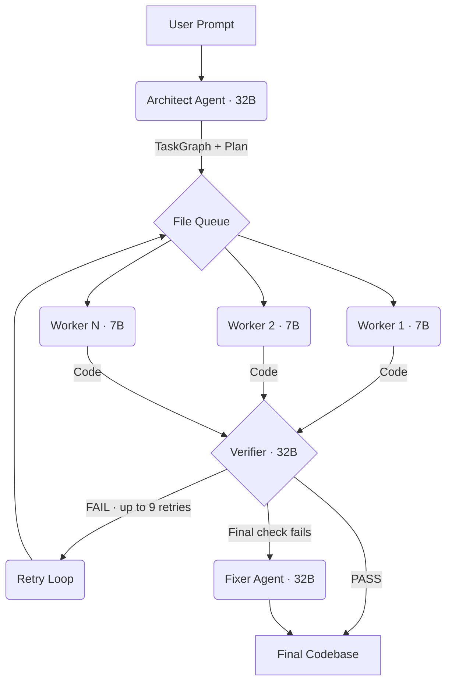

# CogniRoute 🧠 — Multi-Agent AI Code Generation Orchestrator

CogniRoute is an advanced, production-ready multi-agent AI system designed to plan, generate, and self-verify complex software codebases. Instead of relying on a single "one-shot" LLM prompt that often introduces code syntax issues and placeholders, CogniRoute breaks the user request down into a structured task graph of individual files, generates them concurrently using specialized agents, and verifies them through a robust self-healing retry loop.

---

## 🚀 Key Features

* **Multi-Agent Orchestration**: Scopes specialized roles (Architect, Worker, Verifier, Fixer) to act collaboratively like a professional engineering team.
* **Self-Healing Loop**: The Verifier catches syntax issues, missing imports, and placeholder bodies, sending feedback back to Workers for automatic correction.
* **Real-time Server-Sent Events (SSE)**: Streams pipeline status updates and generated code increments to the UI instantly.
* **NVIDIA NIM Support**: Natively compatible with NVIDIA Inference Microservices (NIM) with support for model thinking/reasoning parameters.
* **Zero-Config Simulation Fallback**: Runs a local, high-fidelity offline demonstration showing the full multi-agent loop with simulated self-healing at zero cost if no LLM keys are configured.
* **Unified Vercel Monorepo Deployment**: Deploy both Next.js frontend and Python FastAPI backend on a single domain via native Vercel multi-service configurations.

---

## ⚙️ How It Works



### The 4 Agents Under the Hood:

1. **Architect (32B Reasoning Model)**: Takes the user prompt, drafts an architectural blueprint, and plans a dependency-aware `TaskGraph` listing every required file.
2. **Workers (7B Coding Models)**: Generates the actual source code for a single file, utilizing domain-specific context injected from upstream dependencies.
3. **Verifier (32B Code Reviewer)**: Tests each file for real runtime bugs. Rejected files are returned to the worker with details for correction (up to 9 retries).
4. **Fixer (32B Refactoring Model)**: Runs a final cross-file validation check. If imports or connections are misaligned, the fixer refactors and glues the project together.

---

## 📂 Project Structure

```
├── vercel.json                 # Vercel multi-service deployment settings
├── backend/                    # Python FastAPI Backend
│   ├── app/main.py             # FastAPI controller endpoints
│   ├── cogniroute/             # Core Orchestration Engine
│   │   ├── config.py           # Config settings (.env support)
│   │   ├── orchestration_loop.py # Main loop & SSE logic
│   │   ├── architect_agent.py  # Agent planning layer
│   │   ├── code_worker.py      # Code generation worker
│   │   ├── verifier_agent.py   # Code verification checks
│   │   ├── fixer_agent.py      # Global post-refactoring fixer
│   │   ├── services/
│   │   │   ├── llm.py          # Model-routing client
│   │   │   └── simulator.py    # Local demo simulation engine
│   │   └── schemas/            # Pydantic data models
│   └── requirements.txt        # Backend python dependencies
│
├── frontend/                   # React/Next.js Frontend UI
│   ├── app/page.tsx            # OpenAI-style premium dashboard
│   ├── app/globals.css         # Styling system (glassmorphism)
│   └── next.config.js          # Next.js configurations
│
└── state/                      # Runtime state data
```

---

## 🛠️ Running Locally

You'll need Python 3.10+ and Node.js 18+.

### 1. Backend

1. Navigate to the backend directory and set up a virtual environment:
   ```bash
   cd backend
   python3 -m venv .venv
   source .venv/bin/activate
   pip install -r requirements.txt
   ```

2. Configure environment variables. Copy the `.env.example` file to `.env` at the root directory:
   ```bash
   cp ../.env.example ../.env
   ```

3. Launch the FastAPI server:
   ```bash
   uvicorn app.main:app --reload --port 8000
   ```

### 2. Frontend

1. Navigate to the frontend directory and install packages:
   ```bash
   cd ../frontend
   npm install
   ```

2. Start the Next.js development server:
   ```bash
   npm run dev
   ```

3. Open **[http://localhost:3000](http://localhost:3000)** in your browser.

---

## 🔌 Using NVIDIA NIM (Model Configuration)

To route the multi-agent code generation through NVIDIA NIM endpoints, update your `.env` file at the root:

```bash
# NVIDIA NIM Endpoint
COGNIROUTE_OPENAI_BASE_URL=https://integrate.api.nvidia.com/v1
COGNIROUTE_OPENAI_API_KEY=nvapi-your-api-key-here

# Recommended NVIDIA NIM Models (NIM Llama 3.3 Super Nemotron)
COGNIROUTE_ARCHITECT_MODEL=nvidia/llama-3.3-nemotron-super-49b-v1
COGNIROUTE_WORKER_MODEL=nvidia/llama-3.3-nemotron-super-49b-v1
COGNIROUTE_VERIFIER_MODEL=nvidia/llama-3.3-nemotron-super-49b-v1

# Large reasoning timeout
COGNIROUTE_LLM_TIMEOUT_S=300
```

### Fallback/Offline Simulation Mode:
If `COGNIROUTE_OPENAI_BASE_URL` is commented out or missing from your `.env`, CogniRoute **automatically defaults to local simulation mode**. This generates realistic blueprints (e.g. for "Todo App", "Weather App", "Chat UI") and simulates planning and self-healing completely offline and for free.

---

## ☁️ Deployment (Vercel Multi-Service)

This repository is configured to deploy both frontend and backend automatically to a single Vercel project using the `vercel.json` configuration:

1. Import your GitHub repository into **[Vercel](https://vercel.com)**.
2. Select **Services** as the Framework Preset (Vercel will automatically read `vercel.json`).
3. Add any desired environment variables (like `COGNIROUTE_OPENAI_API_KEY`) under **Settings -> Environment Variables**.
4. Click **Deploy**. Vercel will mount the Next.js frontend at `/` and the FastAPI backend at `/_/backend/`.

---

## 📊 Environment Variables Reference

| Variable | Description | Default |
|---|---|---|
| `COGNIROUTE_OPENAI_BASE_URL` | Base endpoint URL (OpenAI / vLLM / NVIDIA NIM) | `None` (Runs simulation fallback) |
| `COGNIROUTE_OPENAI_API_KEY` | Auth Token for API gateway requests | `None` |
| `COGNIROUTE_MOCK_MODE` | Forces offline simulator mode | `False` |
| `COGNIROUTE_ARCHITECT_MODEL` | Model used for task graph planning | `Qwen/Qwen2.5-32B-Instruct` |
| `COGNIROUTE_WORKER_MODEL` | Model used for file code generation | `Qwen/Qwen2.5-7B-Instruct` |
| `COGNIROUTE_VERIFIER_MODEL` | Model used for syntax and QA verification | `Qwen/Qwen2.5-32B-Instruct` |
| `NEXT_PUBLIC_BACKEND_URL` | Frontend client's backend connection URL | `http://localhost:8000` (local) / `/_/backend` (Vercel) |

---

## 📄 License

MIT License. Free for educational showcases and portfolio presentations.
