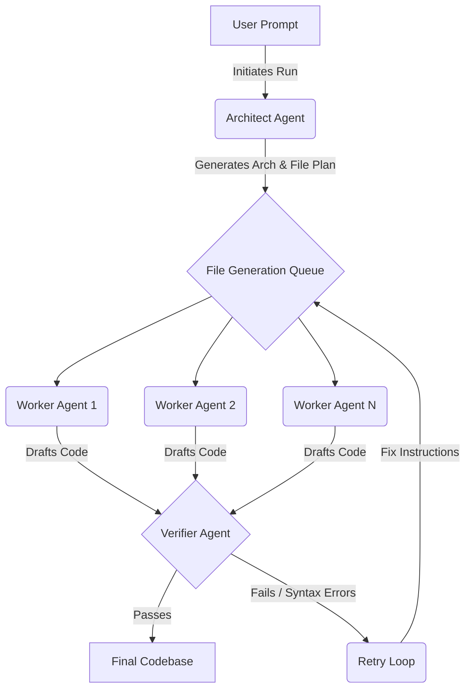

# CogniRoute 🧠

<div align="center">
  <h3>An Advanced Multi-Agent AI Orchestration Runtime & Dashboard</h3>
</div>

---

**CogniRoute** is a sophisticated, open-source multi-agent orchestration runtime designed to autonomously generate, assemble, and verify entire multi-file codebases. It is powered by a scalable **FastAPI** backend and features a stunning, real-time **Next.js** glassmorphic dashboard for visualizing the AI's internal thought processes and execution streams.

## 🌟 Overview

Unlike standard conversational AI, CogniRoute utilizes a specialized multi-agent pipeline to tackle complex coding tasks reliably. It operates by breaking down abstract prompts into concrete file plans, generating code in parallel, and autonomously verifying the output against quality constraints.

### The Pipeline Architecture



## 🤖 Agent Roles

CogniRoute employs three distinct AI profiles to ensure high-quality software generation:

1. **The Architect**: Analyzes the user's objective, formulates a comprehensive system architecture, and outputs a strict JSON plan detailing exactly which files need to be created, their purpose, and their dependencies.
2. **The Workers**: Highly focused, parallel autonomous agents. Each worker takes the Architect's context and instructions for a specific file and drafts the implementation.
3. **The Verifier**: A strict auditing agent that reviews the generated code for syntax errors, missing imports, and logic flaws. If the Verifier finds issues, it rejects the file and sends it back to the Workers with precise fix instructions.

---

## 📂 Project Structure

The repository is divided into two main services:

- **`backend/`**: The core orchestration engine.
  - Built with **FastAPI** (Python 3.10+).
  - Handles the complex asynchronous orchestration loop (`orchestrator.py`).
  - Streams execution events in real-time to the frontend via Server-Sent Events (SSE).
- **`frontend/`**: The real-time command center.
  - Built with **Next.js 15**, **React 19**, and **TailwindCSS 4**.
  - Features a highly polished, dark-mode glassmorphic UI.
  - Tracks live traces, visualizes Architect reasoning, and provides a syntax-highlighted code viewer.
- **`state/`**: Directory for storing persistent orchestration state or outputs.

---

## 🚀 Getting Started (Local Development)

### Prerequisites
- **Python 3.10+**
- **Node.js 18+**
- Applicable API keys for the LLM providers used in the backend.

### 1. Backend Setup

```bash
cd backend
python3 -m venv .venv
source .venv/bin/activate
pip install -r requirements.txt

# Start the orchestration API
uvicorn app.main:app --reload --port 8000
```
*The backend will be available at `http://localhost:8000`.*

### 2. Frontend Setup

```bash
cd frontend
npm install

# Start the Next.js development server
npm run dev
```
*The frontend will be available at `http://localhost:3000`.*

---

## 🐳 Docker Deployment

CogniRoute includes Dockerfiles optimized for containerized deployments (such as HuggingFace Spaces or AWS ECS).

### Backend Image
```bash
docker build -t cogniroute-backend -f Dockerfile .
docker run -p 7860:7860 cogniroute-backend
```

### Frontend Image
The frontend Dockerfile uses multi-stage builds and requires the backend URL at build time for static generation optimization.
```bash
docker build \
  --build-arg NEXT_PUBLIC_BACKEND_URL=http://your-backend-url:7860 \
  -t cogniroute-frontend \
  -f Dockerfile.frontend .

docker run -p 3000:7860 cogniroute-frontend
```

---

## 📡 API Reference

- `POST /run`: Executes the orchestration synchronously and returns the final payload.
- `POST /generate/stream`: The primary endpoint used by the UI. It accepts a JSON payload `{"prompt": "..."}` and returns a `text/event-stream` (SSE) stream of orchestration events (`plan`, `file_start`, `file_verified`, etc.) enabling real-time UI updates.

---

## 🎨 UI Features

- **Event Stream Tracing**: Watch the AI agents think, plan, and execute in real-time with millisecond precision.
- **Architect Insights**: A dedicated tab to read the raw reasoning of the Architect agent before code is even written.
- **Dynamic File Viewer**: Click through generated files and see the code syntax-highlighted instantly as it's completed.
- **Premium Aesthetics**: Engineered with custom scrollbars, subtle radial glows, animated shimmer effects, and absolute zero reliance on basic emojis (fully SVG powered).

---

## 📝 License

This project is licensed under the MIT License.
